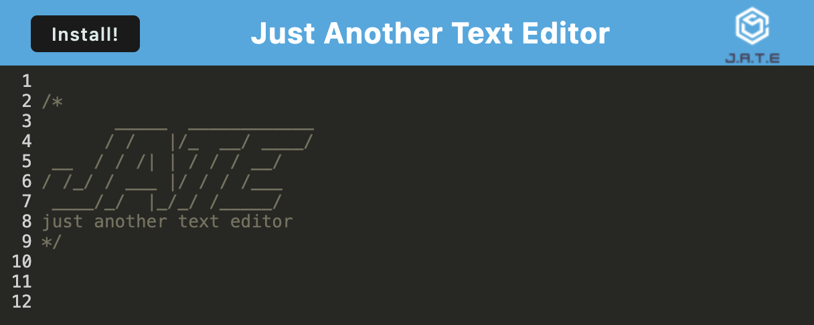

# J.A.T.E - Just Another Text Editor (PWA)

[J.A.T.E. - Just Another Text Editor](https://jate-just-another-text-editor-ql4f.onrender.com) 

## Description

J.A.T.E is a versatile text editor application designed to meet the needs of developers and users alike. Whether you're jotting down notes, writing code snippets, or drafting documents, J.A.T.E provides a seamless editing experience with or without an internet connection.

**Features** 

- **Offline Functionality**: J.A.T.E operates as a Progressive Web Application (PWA), allowing you to access and edit your content even when offline. Say goodbye to interruptions when connectivity is limited.

- **Data Persistence**: Your content is securely stored using multiple data persistence techniques, including IndexedDB, ensuring redundancy and reliability. You can trust that your data will always be accessible when you need it.

- **Intuitive Interface**: With its user-friendly interface and familiar features, J.A.T.E makes editing effortless. Write, edit, and save your content with ease, whether you're a seasoned developer or a casual user.

**Deployment** 

J.A.T.E is deployed using the Render platform, providing a reliable and scalable hosting solution for your text editing needs. With Render, you can deploy and manage your application with confidence, knowing that it's backed by robust infrastructure.

## Table of Contents

- [PWA Text Editor](#pwa-text-editor) 
- [Description](#description) 
- [Table of Contents](#tabel-of-contents) 
- [User Story](#user-story) 
- [Acceptance Criteria](#acceptance-criteria) 
- [Installation](#instllation) 
- [Development](#development) 
- [Usage](#usage) 
- [Technologies](Technologies)
- [License](#license) 
- [Contributing](#contributing) 
- [Tests](#tests) 
- [Resources](#resources) 
- [Questions/Contact](#questionscontact)

## User Story

**AS A** developer  

**I WANT** to create notes or code snippets with or without an internet connection  

**SO THAT** I can reliably retrieve them for later use

## Acceptance Criteria

**GIVEN** a text editor web application

**WHEN** I open my application in my editor  
**THEN** I should see a client server folder structure

**WHEN** I run `npm run start` from the root directory  
**THEN** I find that my application should start up the backend and serve the client

**WHEN** I run the text editor application from my terminal  
**THEN** I find that my JavaScript files have been bundled using webpack

**WHEN** I run my webpack plugins  
**THEN** I find that I have a generated HTML file, service worker, and a manifest file

**WHEN** I use next-gen JavaScript in my application  
**THEN** I find that the text editor still functions in the browser without errors

**WHEN** I open the text editor  
**THEN** I find that IndexedDB has immediately created a database storage

**WHEN** I enter content and subsequently click off of the DOM window  
**THEN** I find that the content in the text editor has been saved with IndexedDB

**WHEN** I reopen the text editor after closing it  
**THEN** I find that the content in the text editor has been retrieved from our IndexedDB

**WHEN** I click on the Install button  
**THEN** I download my web application as an icon on my desktop

**WHEN** I load my web application  
**THEN** I should have a registered service worker using workbox

**WHEN** I register a service worker  
**THEN** I should have my static assets pre cached upon loading along with subsequent pages and static assets

**WHEN** I deploy to Render  
**THEN** I should have proper build scripts for a webpack application

## Installation

1. Clone the repository to your local machine: `git clone https://github.com/TheOarsman/PWA-Text-Editor.git`

2. Navigate to the project directory: `cd PWA-Text-Editor`

3. Install dependencies: `npm install`

**Starting the Development Server** 
To start the development server, run the following command: `npm run start:dev`

This will concurrently start the server and the client application.

**Building for Production** 
To build the project for production, run: `npm run build`

This command will create optimized production-ready bundles for both the server and client.

**Running the Production Server** 
To run the production server, execute: `npm start`

**Accessing the Application** 
Once the server is running, you can access the application by navigating to `http://localhost:3000` in your web browser.

## Development

If you want to contribute to the project or make modifications, follow these steps to set up the development environment:

- Fork repository on Github.
- Check and verify **Prerequisites** in **[Installation](#installation)**, then follow steps 1 - 3.

**Running Tests** 
To execute tests, run the following command: `npm test`

**Code Style** 
The project follows a specific code style. Ensure your changes adhere to the style guidelines before submitting a pull request. You can also lint your code using ESLint by running: `npm run lint`

**Development Server** 
To start the development server with hot reloading, run: `npm run start:dev`

This will concurrently start the server and the client application, allowing you to view changes in real-time.

**Working with the Database** 
The project utilizes IndexedDB for client-side data storage. Make sure to update the database methods (putDb and getDb) as needed when modifying data handling functionality.

**Submitting Changes** 

1. Commit your changes: `git commit -am "Add your message here"`
2. Push to your forked repository: `git push origin master`
3. Open a pull request on the original repository for review.

**Feedback and Contributions** 
Feedback, bug reports, and feature requests are welcome! If you find any issues or have suggestions for improvement, please open an issue or submit a pull request. Your contributions will be greatly appreciated!

## Usage

To run the project locally, follow steps in **[Installation](#installation)**

**Prerequisites**

- `Node.js` and `npm` installed on your machine.

## Technologies

## License

MIT License

Copyright 2024 Heinz Ulrich V

Permission is hereby granted, free of charge, to any person obtaining a copy
of this software and associated documentation files (the "Software"), to deal
in the Software without restriction, including without limitation the rights
to use, copy, modify, merge, publish, distribute, sublicense, and/or sell
copies of the Software, and to permit persons to whom the Software is
furnished to do so, subject to the following conditions:

The above copyright notice and this permission notice shall be included in all
copies or substantial portions of the Software.

THE SOFTWARE IS PROVIDED "AS IS", WITHOUT WARRANTY OF ANY KIND, EXPRESS OR
IMPLIED, INCLUDING BUT NOT LIMITED TO THE WARRANTIES OF MERCHANTABILITY,
FITNESS FOR A PARTICULAR PURPOSE AND NONINFRINGEMENT. IN NO EVENT SHALL THE
AUTHORS OR COPYRIGHT HOLDERS BE LIABLE FOR ANY CLAIM, DAMAGES OR OTHER
LIABILITY, WHETHER IN AN ACTION OF CONTRACT, TORT OR OTHERWISE, ARISING FROM,
OUT OF OR IN CONNECTION WITH THE SOFTWARE OR THE USE OR OTHER DEALINGS IN THE
SOFTWARE.

## Contributing

I welcome contributions from the community to improve and enhance J.A.T.E. Whether it's fixing bugs, adding new features, or improving documentation, your contributions are valuable and appreciated. Join me in making J.A.T.E the best text editor it can be!

## Tests

None currently

## Resources

N/A

## Questions/Contact

**Feedback** 
I value your feedback! If you encounter any issues, have suggestions for improvement, or just want to share your experience with J.A.T.E, please don't hesitate to reach out. Your feedback helps me continue to refine and enhance the application for all users.

**Developer:** Heinz Ulrich V

 

 

 
